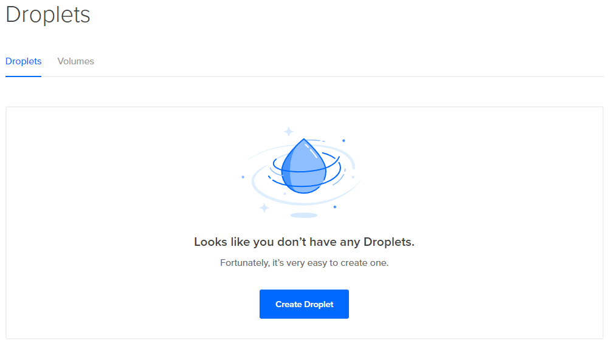
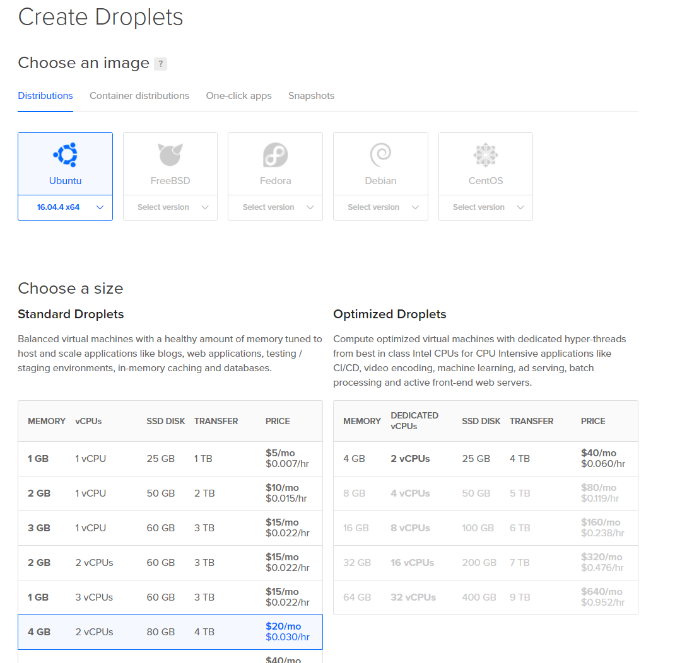
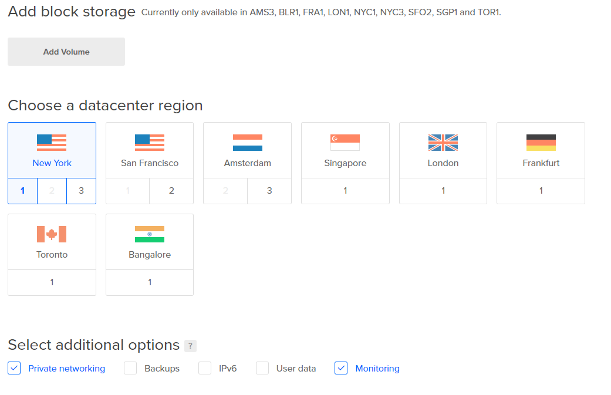
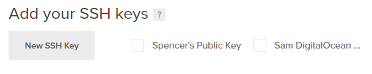
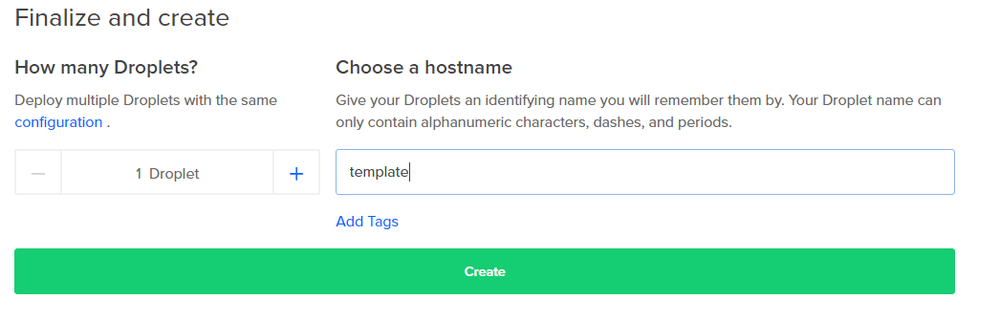

# Your First Instance: Provisioning

**Time Required: 5 Minutes **

If you're already familiar with provisioning and configuring an instance \(droplet\) and just want to get to Docker, you can skip this section.

## Create a Droplet

When you log in to your DigitalOcean account, you'll be greeted with an empty Droplet Management utility.

> #### Aside: Billing Expectations
>
> You will have supplied your provider with billing information by this stage so that you can spin up instances. Depending on how quickly you get through this guide, the total cost should be between **$5** and **$20**, depending on how diligent you are about taking snapshots and destroying your instances at the end of each day. So long as you've made it through the basic security section, you can save a 5-6 minutes each day by skipping the snapshot/destroy/re-create process for each of your instances.

Select **Create Droplet** and let's deploy our first instance.

> #### Aside: Distributions and One-Click Apps
>
> Many providers offer "one-click app" images -- instances that come with flagship applications like MySQL, Docker, NodsJS, or Wordpress already installed. Since this guide is intended to familiarize you with every stage of the development process, we're going to use the basic **distribution** images and install our own apps, but once you know what you're doing, one-click images can save you some time.

## Selecting a Distribution and Instance Size

Keep the default selection of Ubuntu \(16.04 4 as of March 2018\). Select a **4 GB / 2 vCPU** instance size.

> #### Aside: Smaller Instance Sizes
>
> While you can set up MySQL, MSSQL, Docker, or CF on instances with less RAM, saving between **.8** and **1.5** cents per hour \(or **$5/mo\)** is not really worth sacrificing the resources -- in some cases, your services will need extra configuration to run with low memory, and we prefer "fast and simple" over having to add low-memory configuration that we'd then have to pull out when scaling up later anyway.
>
> #### Aside: Distributions Other than Ubuntu
>
> We use Ubuntu in this guide, but you can run everything you need for a CF pipeline on most distributions. If you select a distribution other than Ubuntu, check your provider or Google for links to configuration guides specific to your distribution.

### Don't Add Block Storage For Now

Part of our deployment strategy will be to keep application data \(databases, web site media, or anything that isn't coming from a package manager or a repository\) on separate block storage, such that we can deploy new server instances for testing and then simply move the block storage from the old servers to the new ones when we're ready to go live without having to copy data between instances.

For the moment, we're just concerned with our "lowest common denominator" configuration -- authentication and security that will be the template for all our future instances. Block storage instances have specific names and each one can only be attached to a single compute instance, so we don't want instructions to mount this or that particular storage instance in our generic instance DNA.

Later on, once we have a snapshot of our generic instance and we're ready to deploy specific services like our database server, we'll provision and attach block storage.

### Datacenter Region: Geography with the Options You Need

For the purposes of this guide, all our instances will be deployed in the same datacenter. Be sure to select a datacenter that supports block storage, since we'll be adding it later. Also enable Private networking, and \(optionally\) monitoring. We can always activate Backups or IPV6 later.

> #### Aside: User Data and Cloud-Init
>
> The "User data" option is a very powerful tool that enables you to provide some basic scripting using YAML to create users, assign permissions, add SSH keys, and perform other "first boot" tasks. We'll be using a simpler mechanism to achieve the same result, which is a snapshot of our "basic template instance" after we've configured it, but Cloud-init is much more flexible and lightweight. It's beyond the scope of this guide, but the more your basic server configuration changes \(like users coming and going\), the sooner you'll want a proper initialization like cloud-init.
>
> Further Reading: DigitalOcean has [an introductory guide to cloud-config scripting.](https://www.digitalocean.com/community/tutorials/an-introduction-to-cloud-config-scripting)

### \(Optional\) Add SSH Keys

If you've added SSH keys to your DigitalOcean account, you can specify one or more of those keys here to grant them access to the root login. If you haven't been through this process, don't worry about it for now; the next section will guide you through it. If you do specify keys during this step, you'll use one of those keys to login as root; if not, you'll receive a password via email.

### Name It and Create It

The default name for your instance is likely some combination of the OS, the datacenter, and the specs, e.g. **ubuntu-s-2vcpu-4gb-nyc1-01**. Use a naming scheme that distinguishes the function and place in the pipeline. Since this is our first droplet and we're going to clone it when we're ready to set up our services later on, we'll name it **template**.

