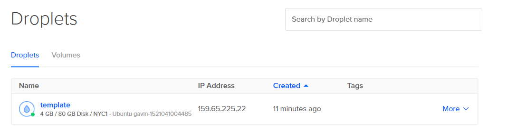
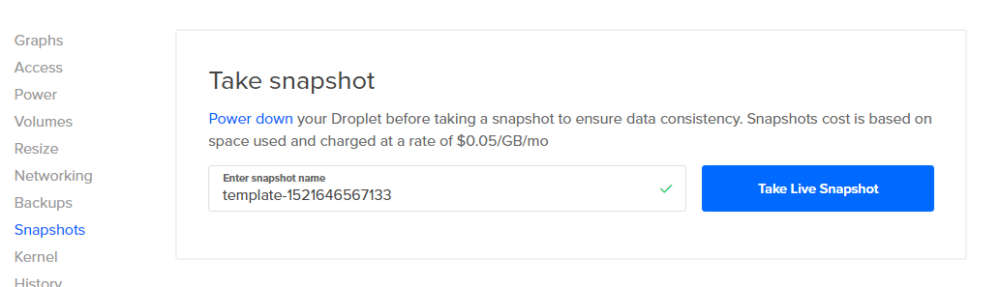
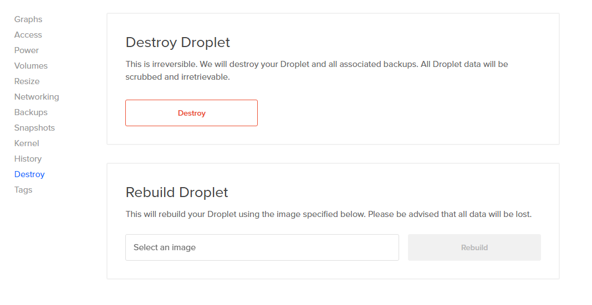

# Your First Instance: Taking A Snapshot

## Take a Template Snapshot

**Time Required: 5 Minutes \(Mostly waiting for snapshot generation\)**

Once you've completed the Initial Server Setup, shutdown your instance with:

```text
sudo shutdown -h now
```

You can power off your instance from your provider control panel \(The **Power** sub-menu for your droplet on DigitalOcean\) but it is always best to do so from the command line. \(Note: On occasion, you may still have to power off your droplet from the control panel, even if you shut it down from the command line\)

Select your **template** Droplet:Then select the **Snapshots** menu and enter a name for your template snapshot. By default, the snapshot will be named after the instance, followed by a unique code; You can remove the trailing -code and just call it **template** since we'll be destroying our Droplet with the same name in a moment and left with only one thing called **template. **

## Destroy Your Droplet

Now that we have a snapshot we can use to build all our future Droplets, we don't need this one anymore. Select the **Destroy** submenu for your Droplet.

