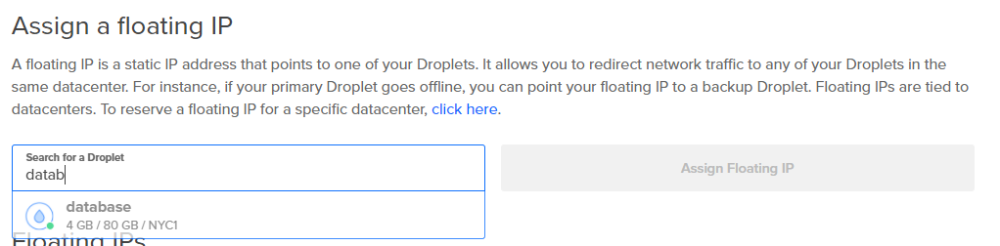
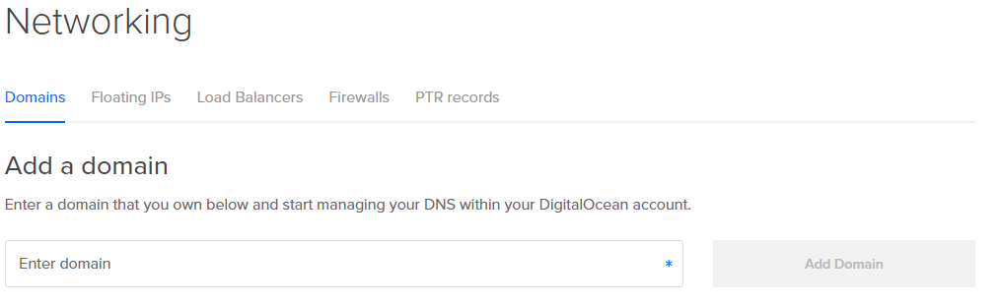

# Database Setup: Instance Prep

**Time Required: 5-10 Minutes \(depending on whether you use Domain/DNS control\)**

Before we install our preferred database software, a couple of tweaks to our basic instance template will help us with administration later on.

## Floating IPs: A Good Idea For Database Servers

Every Droplet is assigned a unique IP address upon creation, but a [Blue/Green deployment strategy](http://searchitoperations.techtarget.com/definition/blue-green-deployment) requires the capacity to rapidly "re-point" our services -- for example, an upgrade to our database server software might put our application out of commission for half an hour, but if we can perform the upgrade on a separate instance and point our database IP at that instance, we can minimize or even eliminate downtime.

Floating IPs are reserved IP addresses assigned to your account \(in this guide's case, our DigitalOcean account\) that you can assign to a droplet to provide some consistency in your DNS records, e.g. you want **db.mydomain.com** to point to your database droplet, but you want that droplet to have the same IP every time.

Navigate to the **Networking** menu and select **Floating IPs**.

Select the database droplet you created in the previous step and **Assign Floating IP**.

## \(Optional\) Domain and DNS Control

DigitalOcean and many other providers offer control panel access to domain and DNS settings. We recommend taking advantage of this free service so that you can assign DNS records to your instances. If you're just experimenting, you might [create a subdomain](http://help.dnsmadeeasy.com/view-tutorials/create-delegate-subdomain-managed-dns-domain/) like **cloud.mycompany.com** so that your DigitalOcean instances get the benefit of DNS without complicating your existing setup; but easier still to grab a custom domain and let DigitalOcean manage the DNS.

## Attaching Block Storage

Since we provisioned 20 GB of block storage when creating the database instance, it is already available to the instance, but the storage hasn't been partitioned, formatted, or mounted. We'll only need to partition and format the storage device once, but we want to auto-mount it every time we start our database droplet.

This process is covered in detail in the [DigitalOcean tutorial for partitioning and formatting block storage volumes in LInux.](https://www.digitalocean.com/community/tutorials/how-to-partition-and-format-digitalocean-block-storage-volumes-in-linux) You can follow this guide exactly: the only real decisions are:

* Which filesystem you want to use: and for database server storage, Ext4 is a fine choice. 
* Where to mount the storage device: Let's use something context-appropriate and use **/mnt/db** as our mount point \(instead of the tutorial's example of **/mnt/volume-nyc1-01-part1\)**,  and then create two subfolders: database \(to hold our database files\) and logs \(to hold our database log files\)

> ### Aside: The 'nofail' Option When Updating /etc/fstab if You Remove Block Storage
>
> If you followed the tutorial's advice and added the **nofail** option to **/etc/fstab**, you can detach the block storage volume from your instance and your OS will log an error at boot time but continue to boot without it.

Now that we have an instance with dedicated block storage, let's install our RDBMS package.

## MySQL, Microsoft SQL, or Other

While this guide provides \(or links to\) specific setup instructions for MySQL and Microsoft SQL Server, there is very little difference with respect to the setup process outside of the configuration of the RDBMS platform you choose.

* Install the package from the repository
* Configure the installed RDBMS to use your block storage for database and log files
* Create a provider-level Firewall rule that we'll use to allow other instances access to the database but block everyone else

