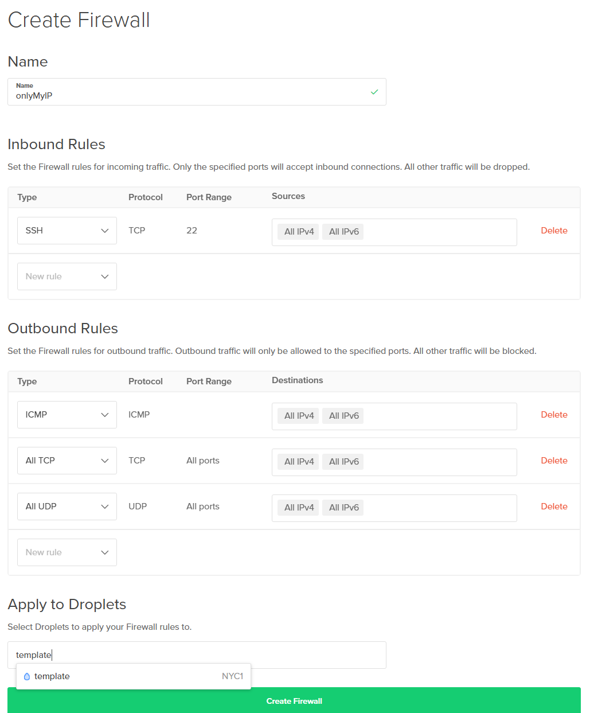

# Your First Instance: \(Optional\) Provider-Level Firewall

**Time Required: 5 Minutes**

The Initial Server Setup guide enabled the [Uncomplicated Firewall](https://help.ubuntu.com/community/UFW) \(UFW\) to allow only SSH connections to our Droplet. We'll make further use of UFW later on, and you can use it extensively and exclusively -- but since we'd have to deal with UFW configuration on each and every Droplet, let's have a look at the provider-level Firewall tools.

From your DigitalOcean account, select the **Networking** top menu and the **Firewalls** sub-menu. Select **Create Firewall**.

Let's create a simple Firewall rule to restrict SSH access to only our current public IP address.


## Aside: Illustration Purposes Only

Limiting Droplet access to a single IP is not desirable in any real-world scenario; we're doing it only to illustrate an example of configuration control on the provider level. Keep in mind that your Droplet is always accessible via console from the DigitalOcean control panel regardless of your Firewall settings. Also, the template configuration we already have restricts everything except SSH connections, and that's "pretty secure"

A likely use case for a similar rule would be to restrict SSH access to anyone on your corporate network or your VPN. This works identically to our example below, but instead of a single IP address, you'd add one or more subnets -- and in the case of a VPN, you'd have to make sure the client is installed on the instance, and our template instance doesn't have a VPN client on it; but yours easily could.

This guide is about rapidly deploying a CF pipeline with reasonable base-line security. Network topology and security requirements require careful consideration that is beyond the scope of this guide.

The default DigitalOcean Firewall configuration blocks all incoming requests except for SSH on port 22.


Under **Inbound Rules**, remove **All IPv4** and **All IPv6** and add your public Internet address \(from [What Is My IP Address](https://whatismyipaddress.com/)\). Note that you can also input other Droplets, load balancers, or tags \(groups of Droplets\) instead of IP addresses or subnets.

Your **Inbound Rules** section should look like this, only with your IP in place of **1.2.3.4**:

Once you have a Firewall setup you like, you can apply it to one or more Droplets at any time. You don't actually need to do this now, because we're going to be destroying our template droplet in a moment; but if you wanted to activate this configuration and save it for future Droplets, you'd enter their names at the bottom and select **Create Firewall**.

