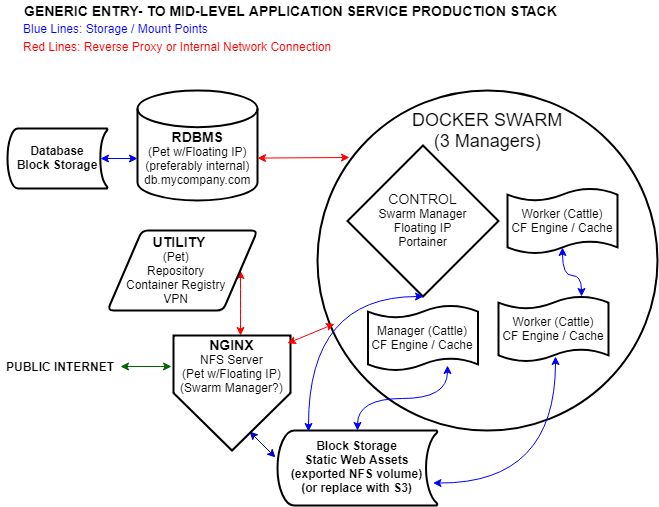

# Part 5: Instance Setup \(How Many and What Kind\)

Now that we have infrastructure ready for us in the cloud, we have to decide how much of it we need and what our network will look like. There isn't a single best answer, and we don't have the space here to cover even all the plausible scenarios. Instead, we'll stick to our "fast but powerful" mission and cook up a network that:

* Can support a small-to-medium size institution with several CF applications
* Can be deployed fairly quickly with an enthusiast but not expert level of familiarity with system and network administration
* Will provide us with the tools we'll need if and when we outgrow its limitations


#### Aside: Experimentation Is Rewarding

One of the difficulties in generalizing a tutorial is glossing over some areas \(like infrastructure\) where there are a lot of great answers. We're constrained by our "...In Two Days" mission, but if you're not in a hurry, there's no reason you can't mix and match which services go in which instances, or containerize something for production that we don't. Even our choice of Ubuntu as OS is just a common denominator: there are a lot of exciting developments happening with lightweight, containerized deployments \(CoreOS and RancherOS, to name just two!\). If you find a solution that works as well or better than anything in this guide and it's no more difficult to set up, let us know!


## Four Compute and Two Block Storage Instances: An Entry- to Mid-Level Network Layout

We have to give each of our component services a home, and we know that we can containerize any of them. In determining default instance size, remember that it's very simple to move up and a nuisance to move down. The default selections we've made are above the minimum requirements for each service, so in each case, you can squeak by if saving $5-$10/mo. is meaningful savings.

* Instance 1: **Database Server**: **CPU:** Dependent on how many end-users are accessing your applications at once, your caching model, and how complicated the queries are; **RAM:** Dependent on how large your database is. We'll start with **4GB** of RAM and **2** vCPUs, which is plenty for a small MySQL or MSSQL database. We'll attach a block storage volume to hold our database and log files so that we can minimize downtime if we have to make changes to our database server.
* Instance 2: **Front-end web server** \(e.g. NGINX, Apache, or IIS\). **CPU and RAM:** NGINX is very lightweight and a little will go a long way. We'll start with **4GB** of RAM and **2** vCPUs here as well, but we could get by with less. We'll attach a block storage volume for static web assets as well.
* Instance 3: **Mission-Critical Internal Services** \(e.g. Docker Swarm Manager or Kubernetes Master: For the sake of tidiness, we'll isolate anything critical to keeping the lights on. We don't need very much horsepower: **2GB** of RAM and **2** vCPUs should be sufficient and let us run some of our optional services on the same instance.
* Instance 4+: **Application Server Workers** \(Coldfusion with a Servlet Container \(Tomcat or Undertow\) and our Cache engine \(Redis, Couchbase, etc.\) **CPU and RAM:** Our Java-based services are going to be hungrier than anything else, but more for RAM than CPU. We'll use the same instance size of **4GB** of RAM and **2** vCPUs here as well. We can increase the resources on this instance or just add more instances as this will be the backbone of our container deployment.

We can stash these two services on one of our existing instances:

* **\(Optional\) NFS Server**:  For low- to medium traffic sites, we can proxy every request from NGINX to our CF container\(s\) in the swarm; but we don't need CF containers to serve static assets, so it'd be nice for NGINX to handle this. We want our application servers to be able to share the block storage volume attached to our front end web servers. Setting up NFS to expose this volume to one or more application servers doesn't require significant time or resources; we'll put this on Instance 2 since that's where the storage volume is. 
* **\(Optional\) VPN Server**. Unless you have dozens or hundreds of clients connecting to your VPN, your VPN server will consume a negligible amount of resources.  We'll put a VPN server on Instance 3 with our swarm manager.

## Cows Per Instance: To Containerize Or Not To Containerize

How do we determine which services to run through Docker and which to run natively?

* **Maximum Cattle:** We could run all our other services \(database, web server, application server\) in Docker containers.   
* **Maximum Pets:** We could drop Docker entirely and provision separate Droplets for each of our services: a database droplet, application \(CF\) droplets, and a front-end web droplet. 
* **Hybrid:** We consider each part of our pipeline separately: for development, since we have to provide uniform environments to everyone on our team, we'll containerize everything. For production, we'll consider the cost \(in time and expertise\) of containerization versus the ease of management for services like our RDBMS and our front-end web server that won't need to scale as quickly as our application server will.

This guide will take the **Hybrid** approach. [As the pets/cattle slide says](../), "pets with strong configuration management are still needed." Unless we need a distributed database, docker-izing our RDBMS is overkill. We'll have to be sure to satisfy the "strong configuration management" piece, but for an introduction to Docker in a short amount of time, let's focus just on the application server and the front-end web server. For production, we'll only containerize Coldfusion and a cache \(like Redis or Couchbase\).

### The Goal Line: Our Sample Network Diagram

> #### Aside: Instances or Droplets?
>
> The examples in this guide happen to use DigitalOcean, which refers to their virtual machine hosts as "Droplets." When we use this term in an example or a screenshot, we're referring to what most other providers call "cloud compute instances." We'll typically say "an instance," but it's interchangable with "a Droplet" \(or "a Linode" if Linode is your provider\)

### In This Section, We Will...

* Provision our first cloud compute instance
* Add a basic, replicable configuration template: logins for ourselves \(and anyone else who should have access to all our instances\), public key configuration, disabling password logins, and basic UFW firewall setup
* Test a provider-level firewall template to complement or individual instance security
* Take a snapshot of our instance to use as a starting point for future instances

