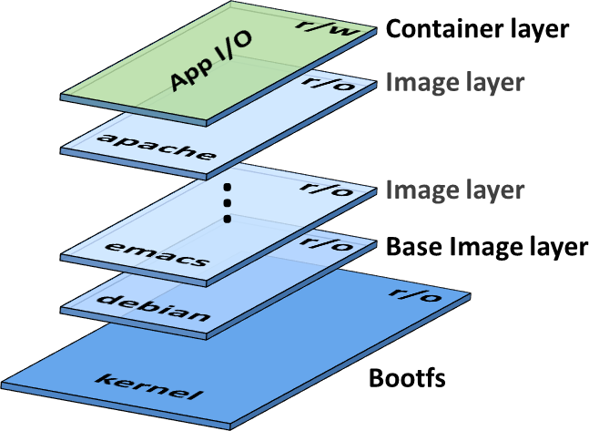
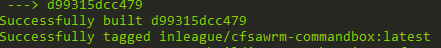

# Our First Image: A Sample Build Environment

## Our First Image: A Sample Build Environment

Clone our sample Docker build environment at [https://github.com/inLeagueLLC/simple-docker-build](https://github.com/inLeagueLLC/simple-docker-build) and let's look a couple ways to make our own images.

```text
git clone https://github.com/inLeagueLLC/simple-docker-build.git
```

Docker images are built from Dockerfiles. From the invaluable [Dockerfile Reference:](https://docs.docker.com/engine/reference/builder/)

> Docker can build images automatically by reading the instructions from a Dockerfile. A Dockerfile is a text document that contains all the commands a user could call on the command line to assemble an image. Using docker build users can create an automated build that executes several command-line instructions in succession.

### What is a "Docker Build" process?

Running the [docker build](https://docs.docker.com/engine/reference/commandline/build/) or `docker-compose build` commands will create a temporary Docker container based on the previous image \(specified in the `FROM` directive below\) and then translate all of the other directives in the Dockerfile into configuration for the container or else commands to run inside the container. Every individual Dockerfile command creates a new image layer, and Docker will always rebuild the fewest layers possible when it can re-use "higher" layers -- that is, if you take a Dockerfile with 10 directives, build it, and then add an 11th directive to copy a file from the host onto the image, when you build it again it will only execute the 11th directive; the previous 10 layers haven't changed.


It's always a good idea to put the directives that will change most often later in your Dockerfile, and the directives that will not change very often above them; this will keep your Docker builds from re-building layers that haven't changed.


Let's have a line-by-line look at the [Dockerfile](https://github.com/inLeagueLLC/simple-docker-build/blob/master/Dockerfile) and an alternate "tag" build, [Dockerfile.Alpine](https://github.com/inLeagueLLC/simple-docker-build/blob/master/Dockerfile.Alpine). As with `docker-compose.yml`, lines begining with `#` are comments and are disregarded by Docker.

### FROM ortussolutions/commandbox

This is a common, shorthand reference for the following Docker image: `docker.io/ortussolutions/commandbox`. **ortussolutions** is the account name and **commandbox** is the image name. **docker.io** is Docker Hub, and Docker will always use that address unless you specify a fully-qualified domain name for a different container registry \(e.g. `registry.mycompany.com/path/to/image`\).

The term "Docker Image" usually refers to an amalgam of several images: for example, the "Ortus Commandbox Docker Image" \(singular\) is actually several images, each of which has its own Dockerfile. Every Docker image is built on another Docker image, which is why you'll often see Docker images visualized like this:

 \(source: Neo Kobo's "[Docker Container](http://neokobo.blogspot.com/2017/03/docker-container.html)" blog, March 2017\)

Every Dockerfile starts with a `FROM` directive that points to the image "beneath" it in the stack. This is one reason Docker images are so powerful: it's trivial to build on stable, well-established, "official" images; you may need to customize a few things here or there, but you don't need to re-invent the wheel.

#### Image tags and Alternate Build Files

Once you're comfortable building Docker images, you may find that you want several versions of the same image: perhaps you want one Commandbox image for local development and another for production, or perhaps you want to experiment with a different version of Adobe CF or Lucee without changing your existing deployments. You could simply make a whole new image, but this gets unwieldy very quickly, especially when the images may only have small differences between them. The solution is **image tags**. For example, the Commandbox image is based on Ubuntu Linux, but a common alternative for many official Docker images is Alpine Linux. That is what we're asking for in our alternate Dockerfile, `Dockerfile.Alpine`:

`FROM ortussolutions/commandbox:alpine`

You'll often see image tags used to specify individual versions of applications, e.g. `mysql:5.5` versus `mysql:8.0`. If no tag is specified, Docker will use the tag `latest` by default.

### LABEL maintainer "Samuel Knowlton [sam@inleague.org](mailto:sam@inleague.org)" \(Image Metadata\)

LABELs are optional metadata descriptors for your Dockerfile that will appear whenever an image based on your image is inspected via `docker inspect`. You can use any label, or you can conform to the [Label Schema Convention](http://label-schema.org/). Or you can ignore Labels entirely.

### ARG DEBIAN\_FRONTEND=noninteractive \(Build-time OS Settings\)

`ARG` is similar to `ENV` that we'll see in a moment: it sets an environment variable inside the container, in this case telling Ubuntu that the console is being run by an automated tool and to ignore some warning output it might otherwise show us. Unlike `ENV`, `ARG` environment variables are only set during the build process, while `ENV` sets environment variables anytime a container based on this image is created. This particular `ARG` is not necessary, but it makes the output of the rest of the build process a little cleaner.

### RUN apt-get update && apt-get install -y nano &&  rm -rf /var/lib/apt/lists/\* \(Installing OS Packages\)

It's three commands in one! Why?

**Because each directive in a Dockerfile creates a new layer.** A common convention in Dockerfiles is to "chain" commands that all relate to one logical stage of the build process: in this case, `apt-get update` \(since Docker images usually clean out `apt` archives before they finish, as ours will, too\); `apt-get install -y nano` will install the nano text editor without prompting us to confirm; and `rm -rf /var/lib/apt/lists/*` will delete the `apt` archives we downloaded with `apt-get update`. The resulting layer will have all of those changes processed as a single layer, such that the only difference between this layer and the previous one is that `nano` has been installed.

For readability, these chained commands are usually written as some variation of the following:

```text
RUN doSomeCommand &&
    \ doSecondCommand &&
    \ doThirdCommand && 
    \ doFourthCommand
```

### ENV LUCEE\_EXTENSIONS "99A..." \(Installing Lucee Extensions\)

Commandbox is "warmed up" when it has retrieved and installed the relevant CF Engine `.WAR` file. If you're running Lucee, much of the available functionlaity has been moved out of the WAR file and into Lucee Extensions. While we could add individual `.lex` files to a /deploy folder in our Docker Build process, that folder only exists after the engine itself has been warmed up; far better to tell Lucee what extensions we want during the warm-up process. As of April 2019, the easiest \(if not the friendliest\) means of doing so is to specify the unique ID, name, and version number of each extension in the `LUCEE_EXTENSIONS` environment variable as follows:

`ENV LUCEE_EXTENSIONS "UUID;name=My Extension;version=1.2.0,UUIDForExtension2;name=My Second Extension;version=1.1.0"`

The extension list, unique IDs, and available versions are listed at [download.lucee.org](https://download.lucee.org).


As of [Lucee 5.2.9.38 or 5.3.3.13](https://luceeserver.atlassian.net/browse/LDEV-1196), you can now specify the environment variable `LUCEE_ENABLE_WARMUP true` and the Lucee server will wait until all extensions and deployments are complete before exiting.


### ENV CFENGINE=lucee@5.3.1+102 \(Which Engine to Deploy\)

Another environment variable -- this time, one documented in the Ortus Commandbox Image README. `CFENGINE` tells Commandbox which CF engine we want to deploy. It can be a Forgebox stub \(as the example above is\) or a URL or filesystem location resolving to a WAR file. See other examples in the comments in the Dockerfile!

### RUN box install commandbox-fusionreactor \(Commandbox modules\)

This directive starts Commandbox \(which is already installed by the previous, Ortus image\), downloads the [commandbox-fusionreactor](https://www.forgebox.io/view/commandbox-fusionreactor) module from Forgebox, and installs it.

### RUN ${BUILD\_DIR}/util/warmup-server.sh \(Warm Up The Server\)

This directive is the whole reason we're here: to tell Commandbox we want the CF engine defined in `CFENGINE` downloaded and installed, and then to start it up and install the extensions we've defined in `LUCEE_EXTENSIONS`. This process will usually take at least a couple of minutes, and when it's done, the resulting image will be quite a bit bigger than the Ortus "base" image but it will start up in seconds rather than minutes.

## Running the Build: Docker Build and docker-compose build

Take your Docker Hub account name from the previous section and replace `inleague` with it below to get an **image tag** of `mydockerhubusername/cfswarm-commandbox`:

```text
inleague/cfswarm-commandbox
```

That will be "our" image, instead of `ortussolutions/commandbox`. To build it, we'll run `docker build` with the `-t` option to specify the image tag we want; without it, the image would be built and assigned an alphanumeric ID, but we could only refer to it by that ID. From the top level of the repository directory:

```text
docker build -t mydockerhubusername/cfswarm-commandbox .
```

The `.` in the above command tells Docker to use the current directory as the **build content**, so it will look for a `Dockerfile` in that directory.

You'll see the temporary build container start and run through all the commands in our Dockerfile. After a few minutes, you'll get:



The image exists locally on your machine, so now let's push it up to Docker Hub. First we have to give Docker our Docker Hub credentials, and then we can push our image up:

```text
docker login
(input Docker Hub credentials)
docker push mydockerhubusername/cfswarm-commandbox
```

Now our image is publicly available to anyone via `docker pull mydockerhubusername/cfswarm-commandbox` or else `FROM mydockerhubusername/cfswarm-commandbox` in a Dockerfile.

### docker-compose build

Even if we build our own images every couple of months, it's tedious to type out the tags every time -- especially if you're also specifying a private container registry. `docker-compose build` to the rescue! Have a look at `docker-compose.yml` in the repository you cloned:

```text
version: '3.6'

services:
  cfswarm:
    image: mydockerhubusername/cfswarm-commandbox
    build:
      context: ./
```

`docker-compose build` in the root repository directory will run exactly the same `docker build` command that we ran before. The image tag is pulled from the `image` directive in our YAML file, and the `.` \(context\) from the `build/context` directive.

### Alternate Dockerfiles and docker-compose.yml files

What if we wanted to build an `:alpine` tag of the same image using `Dockerfile.Alpine`?

We can use `docker build` and specify an alternate Dockerfile:

```text
docker build -f Dockerfile.Alpine -t mydockerhubusername/cfswarm-commandbox:alpine .
```

Or we can use an alternate `.yml` file with `docker-compose build`:

```text
docker-compose -f commandbox-alpine.yml build
```

And then push the resulting image up to Docker Hub:

```text
docker push mydockerhubusername/cfswarm-commandbox:alpine
```

Which you use is a matter of preference, but `docker-compose` lets us specify `ARG`s, `LABEL`s, `ENV`s, and all kinds of other options without changing our Dockerfile.

