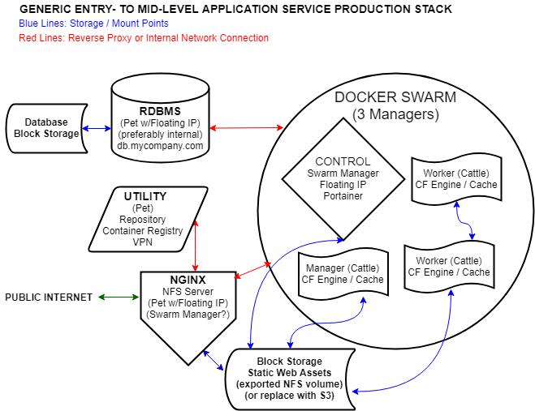

# Part 6: The Production Network Layout \(How Many Instances and What Kind\)

Now that we have infrastructure ready for us in the cloud, we have to decide how much of it we need and what our network will look like. There isn't a single best answer, and we don't have the space here to cover many perfectly plausible scenarios. Instead, we'll stick to our "fast but powerful" mission and cook up a network that:

* Can support a small-to-medium size institution with several CF applications
* Can be deployed fairly quickly with an enthusiast but not expert level of familiarity with system and network administration
* Will provide us with the tools we'll need if and when we outgrow its limitations
* Can support all of our infrastructure dependencies \(e.g. code repositories and container registries\)


#### Aside: Experimentation Is Rewarding

One of the difficulties in generalizing a tutorial is glossing over some areas \(like infrastructure\) where there are a lot of great answers. We're constrained by our "...In a Week" mission, but if you're not in a hurry, there's no reason you can't mix and match which services go in which instances, or containerize something for production that we don't. Even our choice of Ubuntu as OS is just a common denominator: there are a lot of exciting developments happening with lightweight, containerized deployments \(CoreOS and RancherOS, to name just two!\). If you find a solution that works as well or better than anything in this guide and it's no more difficult to set up, let us know!


## Cows Per Instance: To Containerize Or Not To Containerize

How do we determine which services to run through Docker and which to run natively?

* **Maximum Cattle:** We could run all our other services \(database, web server, application server\) in Docker containers.   
* **Maximum Pets:** We could drop Docker entirely and provision separate Droplets for each of our services: a database droplet, application \(CF\) droplets, and a front-end web droplet.  
* **Hybrid:** We consider each part of our pipeline separately: for development, since we have to provide uniform environments to everyone on our team, we'll containerize everything. For production, we'll consider the cost \(in time and expertise\) of containerization versus the ease of management for services like our RDBMS and our front-end web server that won't need to scale as quickly as our application server will.

This guide will take the **Hybrid** approach. [As the pets/cattle slide says](../), "pets with strong configuration management are still needed." Unless we need a distributed database, docker-izing our RDBMS is overkill. We'll have to be sure to satisfy the "strong configuration management" piece, but for an introduction to Docker in a short amount of time, let's focus just on the application server and the front-end web server. For production, we'll only containerize Coldfusion and a cache \(like Redis or Couchbase\).


**Strong Configuration Management** is beyond the scope of this edition, but there are many options available that enable you to prepare "recipes" for your cloud infrastructure. The mechanism we use in this guide of setting up a "base" Droplet snapshot and cloning it is very simple but it doesn't scale; if you're interested in a proper DevOps solution to this problem, check out [Terraform](https://www.terraform.io/)!


### The Goal Line: Our Sample Network Diagram

> #### Aside: Instances or Droplets?
>
> The examples in this guide happen to use DigitalOcean, which refers to their virtual machine hosts as "Droplets." When we use this term in an example or a screenshot, we're referring to what most other providers call "cloud compute instances." We'll typically say "an instance," but it's interchangable with "a Droplet" \(or "a Linode" if Linode is your provider\)

## 5-6 Compute and Two Block Storage Instances: An Entry- to Mid-Level Network Layout

We have to give each of our component services a home, and we know that we can containerize any of them. In determining default instance size, remember that it's very simple to move up and a nuisance to move down. The default selections we've made are above the minimum requirements for each service, so in each case, you can squeak by if saving $5-$10/mo. is meaningful savings.


It's easy to re-size a DigitalOcean droplet ... provided you don't re-size the disk as well! Start off with a small amount of SSD space on your droplet; any serious storage will be done either in a storage cloud like S3 or on your block storage instances, so the droplets themselves don't need very much space. You'll also be able to re-size CPU and RAM up or down as needed; if you start with a larger droplet's disk allocation, you can't "move down" without a lot of extra work!


* Instance 1: **Database Server** \(Floating IP\): **CPU:** Dependent on how many end-users are accessing your applications at once, your caching model, and how complicated the queries are; **RAM:** Dependent on how large your database is. We'll start with **4GB** of RAM and **2** vCPUs, which is plenty for a small MySQL or MSSQL database. We'll attach a block storage volume to hold our database and log files so that we can minimize downtime if we have to make changes to our database server.
* Instance 2: **Front-end web server** \(Floating IP\) \(e.g. NGINX, Apache, or IIS\). **CPU and RAM:** NGINX is very lightweight and a little will go a long way. We'll start with **4GB** of RAM and **2** vCPUs here as well, but we could get by with less. We'll attach a block storage volume for static web assets as well.
* Instance 3: **Internal Utilities** \(e.g. Gitlab, VPN server\). While it's possible to use cloud providers for infrastructure like repositories, registries, and VPN control, doing so costs us both dollars \(moreso than the additional droplet\) and latency, since all of our services that depend upon these cloud providers will be slower than if they were on the same local network as the rest of our stack. We'll also save on bandwidth costs if everything in our stack can communicate on an internal network.
* Instance 4: **Container Orchestration** \(e.g. Docker Swarm Manager or Kubernetes Master: This is another preference rather than a requirement, but having a single instance whose only function is container orchestration and any related services \(like Portainer\) makes for cleaner visualization and management; it also reduces the likelihood that a stray container going haywire will bring down all of your managers.  We don't need very much horsepower: **2GB** of RAM and **2** vCPUs should be sufficient and let us run some of our optional services on the same instance.
* Instance 5+: **Application Server Workers** \(Coldfusion with a Servlet Container \(Tomcat or Undertow\) and our Cache engine \(Redis, Couchbase, etc.\) **CPU and RAM:** Our Java-based services are going to be hungrier than anything else, but more for RAM than CPU. We'll use the same instance size of **4GB** of RAM and **2** vCPUs here as well. We can increase the resources on this instance or just add more instances as this will be the backbone of our container deployment.


Swarm orchestration should have an odd number of [**swarm managers**](https://docs.docker.com/engine/swarm/how-swarm-mode-works/nodes/). While only one manager node is required, even a small production stack should have at least three: this setup will tolerate the loss of one manager node, allowing you to update or temporarily bring down a manager for maintenance, or simply to update Docker. With only one manager node, the entire swarm will fail if it ever goes down.

If the number and size of applications you have to support is on the smaller side, you can save a few dollars by anointing Instance 2 \(NGINX\) or Instance 3 \(Utilities\) as Swarm nodes whose only job is to manage the Swarm \(rather than running any of your services\). This shortcut means you may only need one "worker node" for your CF Application\(s\), but it carries some debt; it's cleaner to keep your swarm completely isolated from the rest of your support infrastructure. If you do make any of the non-Docker-dedicated instances Swarm managers, be sure to use deployment preferences to keep anything other than the smallest Services from running on them.


Two optional but very useful services to add to your stack should live outside the Swarm:

* **\(Optional\) NFS Server**: For low- to medium traffic sites, we can proxy every request from NGINX to our CF container\(s\) in the swarm; but we don't need CF containers to serve static assets, so it'd be nice for NGINX to handle this. Alternatively, we may want to share static assets between multiple containers, and then we run into the Swarm Persistent Storage Problem. We want our application servers to be able to share the block storage volume attached to our front end web servers. Setting up NFS to expose this volume to one or more application servers doesn't require significant time or resources; we'll put this on Instance 2 since that's where the storage volume is. This is a low-rent solution to the problem of shared swarm storage; be sure to read the section on Swarm Persistent Storage!
* **\(Optional\) VPN Server**. Unless you have dozens or hundreds of clients connecting to your VPN, your VPN server will consume a negligible amount of resources. We'll put a VPN server on Instance 3 with our swarm manager.
* **\(Optional\) Repository / Registry / CI & CD** . It's a great time to be in the market for source control, docker container registries, and CI/CD engines. At inLeague, we don't have a dedicated DevOps team, so we needed a solution that was easy to manage and that would integrate well with the rest of our stack with as little specialized integration work as possible. We really like Gitlab, but everything in this guide applies just the same to any on-premises solution \(like Bitbucket\) and very nearly the same if you use an external, cloud-hosted solution like Github, Bitbucket Cloud, or Gitlab.com. Why do we prefer Gitlab?
* Combines source control, container registry, CI/CD, and issue tracking
* The Omnibus Install makes it trivial to set up
* Can use any S3 compatible solution \(like \[DigitalOcean Spaces\]

  \([https://www.digitalocean.com/products/spaces/](https://www.digitalocean.com/products/spaces/)\)\) to store both backups and Docker images 

* Lots of goodies available with paid subscription levels
* With a little extra work, we can re-use an existing part of our stack that Gitlab depends upon \(e.g. NGINX, Postgres, Redis\) rather than duplicating those services just for Gitlab

### In This Section, We Will...

* Provision our first cloud compute instance
* Add a basic, replicable configuration template: logins for ourselves \(and anyone else who should have access to all our instances\), public key configuration, disabling password logins, and basic UFW firewall setup
* Test a provider-level firewall template to complement or individual instance security
* Take a snapshot of our instance to use as a starting point for future instances

