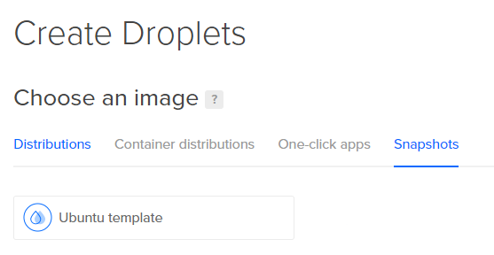
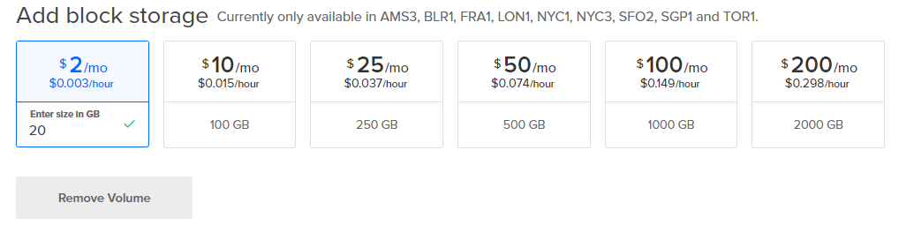
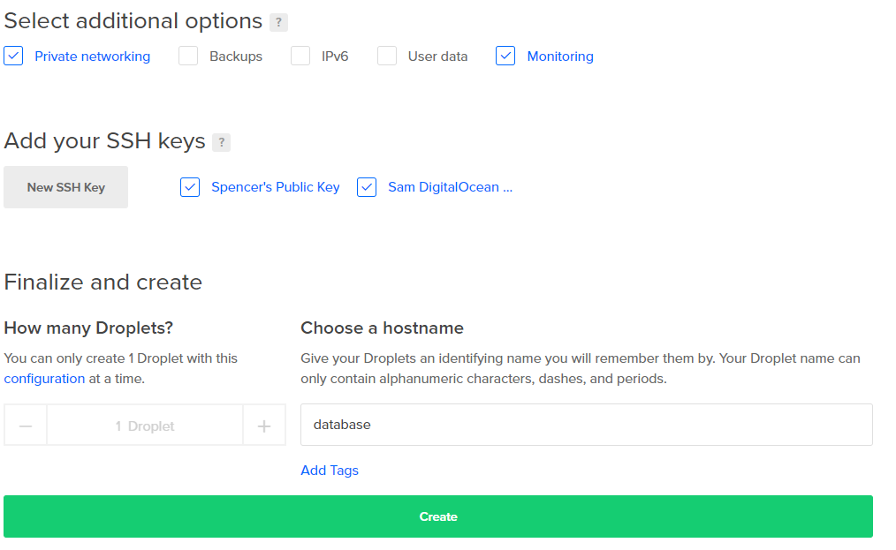

# Part 7: Production Setup \(Outside the Swarm\)

## The Database: A Pet with Strong Configuration Management

The first major component of our pipeline is our database server. We'll make use of Block Storage for the first time, install and configure our preferred RDBMS, and use a provider-level firewall to insure that nobody can access the database outside of our network.

### The Hybrid Approach: Why not Docker-ize the Database?

Since our front-end web server and CF engine will both run in Docker and we know that we're going to invest some time into configuring at least one Docker instance anyway, why not do the same with the database? Two reasons:

1\) When Docker Swarm containers access files from outside their containers, it uses NFS. This isn't a problem if our database files live in the container, but we want our databases to live on persistent storage \(ideally, something separate even from the cloud instance, like a block storage device\). That means that we can't guarantee that the databases will be on the same instance as the database container. Our database would then have to make network file system requests to read and write from the database. This problem isn't especially difficult to solve, but it's not really worth solving for our purposes; The up-front investment of time places it outside the scope of this guide, because...

2\) The benefits of containerizing your database for production systems are realized primarily when you need a distributed \(Master/Slave\) database, and that is a much later-stage scalability concern than our web and application servers that benefit from containerization on day one.

## Provisioning From the Template

We'll use the template we created in [Part 4](https://github.com/MordantWastrel/cf_swarm/tree/9283ab9c2c02a35db461a74c8ffec14e766f3476/part-4-instance-setup-how-many-and-what-kind/README.md) as the foundation for our database droplet. Select **Create Droplet** and then the **Snapshots sub-menu.** The snapshot we created will be called **Ubuntu template** -- DigitalOcean prepends the snapshot name with the OS name, and **template** is the name we assigned, so our Create Droplets page should look like this:

Select an instance size with at least 3 or 4 GB of RAM, and this time we're going to add **Block Storage.**

We'll put our database and log files on the block storage drive. It's trivial to enlarge block storage devices later, so unless you're importing existing databases, 20 GB should be more than enough for our initial database storage.

Don't forget to enable **Private Networking** since we'll want our application server droplet\(s\) to access the database.

Give your droplet a name like **database** and once it's ready, we'll learn how to assign a floating IP address and attach block storage to our instance.

